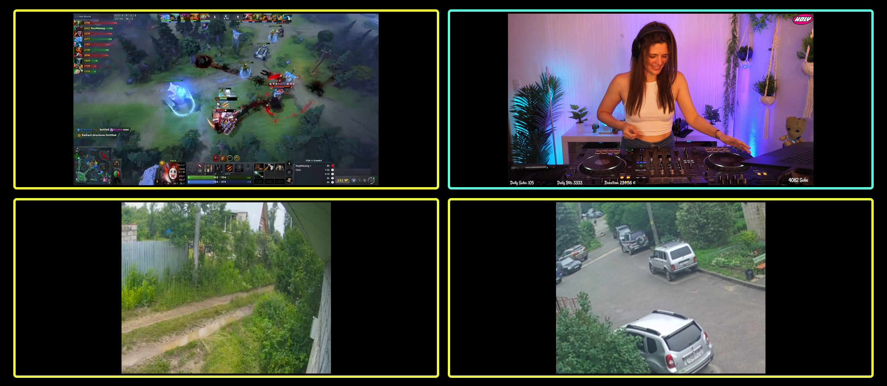

# MultiStream Player

### Introduction
Play up to four streams simultaneously.
* Supports surveillance cameras (RTSP links)
* Compatible with IPTV: M3U8, MPD
* Watch Twitch streams directly in the app
* Easy controls: fullscreen mode, zoom, quick menu

**The app does not contain content, use your own content links.**

### Known Issues

#### Twitch Streams:
* Twitch stream playback works only on devices with Google WebView installed.
* On some devices (for example, the Honor Pad 8), it’s not possible to play multiple Twitch streams with sound at the same time. On such devices, switching audio between stream players may cause streams to pause.
* To avoid this, it’s recommended to mute other streams before enabling sound on the one you want to listen to.

### License
This project is licensed under the Apache License 2.0. See the [LICENSE](LICENSE) and [NOTICE](NOTICE) files for details.
___
### ❤️ Support

* Ozon : 2204 2402 5165 6593
* VISA : 4138 4601 5101 6667

* BTC (Bitcoin)  bc1q5xyw4d0rnue4e67dfme306dmq32tcqcfp4nldp
* ETH (Ethereum) 0xa3ae9d297c6dbc4b6db1cfc6d056ed86ca3209e6
* USDT (Ethereum) 0xa3ae9d297c6dbc4b6db1cfc6d056ed86ca3209e6
* USDC (Ethereum) 0xa3ae9d297c6dbc4b6db1cfc6d056ed86ca3209e6
* SOL (Solana) 4S8eZhQoKpSGfKdo8Bo8KYJR5F66xjAmanJfnvbjKgXB
* TWT (BNB Smart Chain) 0xa3ae9d297c6dbc4b6db1cfc6d056ed86ca3209e6
* BNB (BNB Smart Chain) 0xa3ae9d297c6dbc4b6db1cfc6d056ed86ca3209e6
___